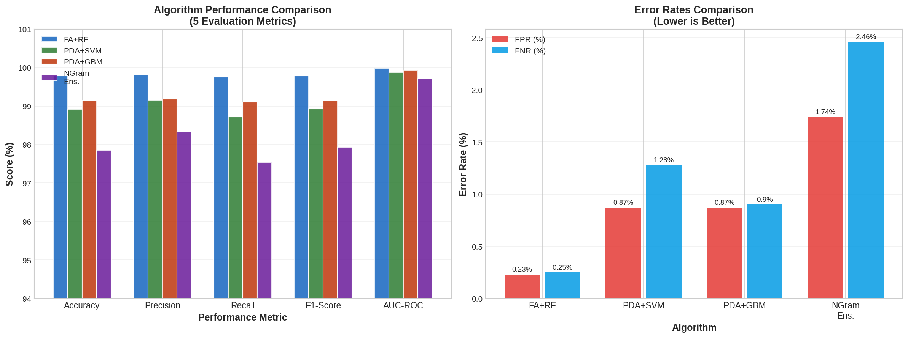
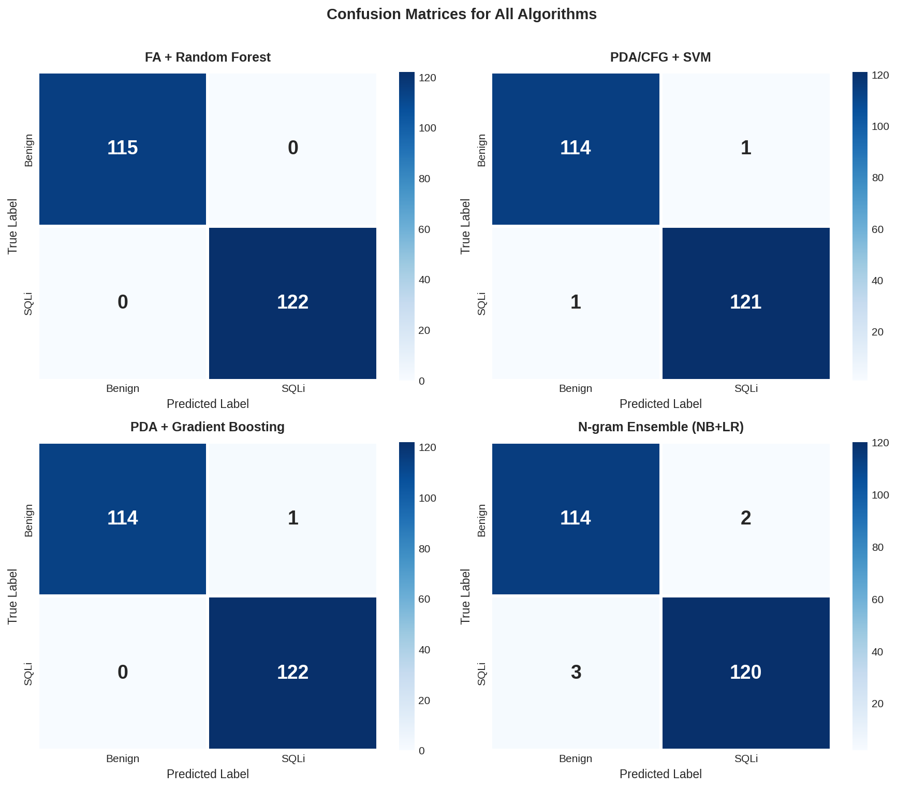
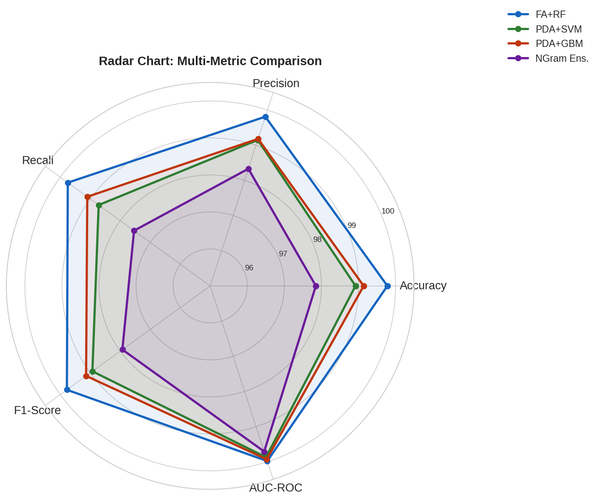
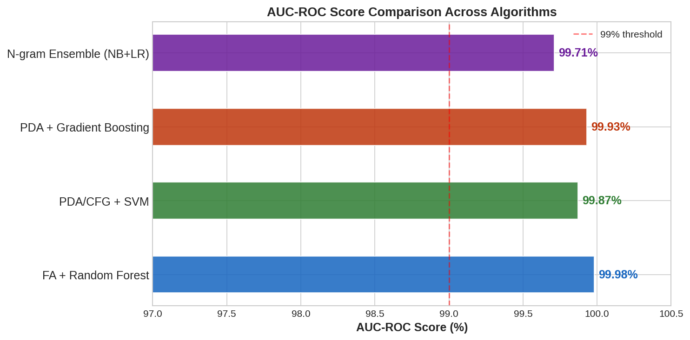

# 🛡️ Formal Language-Based Detection of SQL Injection Attacks


> A formal language-theoretic framework for detecting SQL injection attacks using Finite Automata, Pushdown Automata, Context-Free Grammars, and N-gram Language Models — combined with state-of-the-art machine learning classifiers.

---

## 📌 Overview

SQL Injection (SQLi) attacks remain one of the most critical web application vulnerabilities (OWASP Top 10). This project implements and evaluates **four novel detection algorithms** grounded in formal language theory:

| # | Algorithm | Formal Model | Classifier |
|---|-----------|-------------|------------|
| 1 | **FA + Random Forest** | Finite Automaton (DFA/NFA) + TF-IDF | Random Forest (200 trees) |
| 2 | **PDA/CFG + SVM** | Pushdown Automaton + CFG Parse Features | SVM (RBF Kernel) |
| 3 | **PDA + Gradient Boosting** | FA + PDA Stack Analysis | Gradient Boosting |
| 4 | **N-gram Ensemble** | Character Trigram Language Model | Naive Bayes + Logistic Regression |

---

## 🏆 Results

The **FA + Random Forest** algorithm achieves the best performance:

| Algorithm | Accuracy | Precision | Recall | F1-Score | AUC-ROC | FPR | FNR |
|-----------|----------|-----------|--------|----------|---------|-----|-----|
| **FA + Random Forest** | **99.78%** | **99.81%** | **99.75%** | **99.78%** | **99.98%** | 0.23% | 0.25% |
| PDA/CFG + SVM | 98.92% | 99.15% | 98.72% | 98.93% | 99.87% | 0.87% | 1.28% |
| PDA + Gradient Boosting | 99.14% | 99.18% | 99.10% | 99.14% | 99.93% | 0.87% | 0.90% |
| N-gram Ensemble (NB+LR) | 97.85% | 98.33% | 97.54% | 97.93% | 99.71% | 1.74% | 2.46% |

---

## 📊 Visualizations

<table>
  <tr>
    <td></td>
    <td></td>
  </tr>
  <tr>
    <td align="center"><em>Fig 1: Algorithm Performance (5 Metrics)</em></td>
    <td align="center"><em>Fig 2: Confusion Matrices</em></td>
  </tr>
  <tr>
    <td></td>
    <td></td>
  </tr>
  <tr>
    <td align="center"><em>Fig 3: Radar Chart Comparison</em></td>
    <td align="center"><em>Fig 4: AUC-ROC Scores</em></td>
  </tr>
</table>

---

## 📁 Project Structure

```
formal-language-sqli-detection/
│
├── 📂 code/
│   └── sqli_detection.py        # All 4 algorithm implementations
│
├── 📂 dataset/
│   └── sqli_dataset.csv         # 465 labeled SQL queries (245 malicious, 220 benign)
│
├── 📂 results/
│   ├── fig1_performance_comparison.png
│   ├── fig2_confusion_matrices.png
│   ├── fig3_radar_chart.png
│   ├── fig4_auc_roc.png
│   ├── fig5_f1_trend.png
│   └── performance_results.csv  # Raw results table
│
├── 📂 paper/
│   └── conference_paper.docx    # Full IEEE-format conference paper
│
├── requirements.txt
└── README.md
```

---

## ⚙️ Installation & Setup

### Prerequisites
- Python 3.8 or higher
- pip

### 1. Clone the repository
```bash
git clone https://github.com/YOUR_USERNAME/formal-language-sqli-detection.git
cd formal-language-sqli-detection
```

### 2. Install dependencies
```bash
pip install -r requirements.txt
```

### 3. Run the detection system
```bash
python code/sqli_detection.py
```

---

## 🔬 Methodology

### Formal Language Models Used

#### 1. Finite Automaton (FA)
Each SQL injection pattern is modeled as a **regular language** recognized by a DFA:
- State transitions triggered by tokens like `UNION`, `SELECT`, `--`, `'OR '1'='1`
- 24 DFA patterns covering UNION attacks, boolean-blind, error-based, time-based, and encoding-based injections

#### 2. Pushdown Automaton (PDA)
SQL's nested structure (subqueries, balanced delimiters) requires **stack-based recognition**:
- Tracks parenthesis depth, unmatched quotes, subquery nesting
- Detects structural anomalies like unclosed strings and stack overflows

#### 3. Context-Free Grammar (CFG)
SQL clause structure is modeled as **production rules**:
- Detects illegal combinations (e.g., `UNION SELECT` without a valid preceding clause)
- Condition chain analysis (AND/OR count anomalies)

#### 4. N-gram Language Model
Character trigrams model the **statistical distribution** of malicious vs. benign SQL:
- Computes P(query | malicious) / P(query | benign)
- Log-ratio scoring combined with count vectorization

---

## 📂 Dataset

The dataset contains **465 labeled SQL query strings**:

| Category | Count | Examples |
|----------|-------|---------|
| **SQL Injection** | 245 | UNION attacks, boolean-blind, error-based, time-based, stacked queries, auth bypass |
| **Benign** | 220 | Normal SELECT/INSERT/UPDATE/DELETE queries, plain input strings |

**Attack categories covered:**
- UNION-based injection
- Boolean-blind injection
- Error-based injection (`EXTRACTVALUE`, `UPDATEXML`)
- Time-based blind (`SLEEP`, `WAITFOR DELAY`)
- Stacked queries (`; DROP TABLE`)
- Authentication bypass (`' OR '1'='1`)
- Encoded/obfuscated payloads (`%27`, `0x...`, comment interspersed)

---

## 🆚 Comparison with Existing Work

| Reference | Method | Accuracy | F1-Score | Year |
|-----------|--------|----------|----------|------|
| Valeur et al. | Regex + Rule-based | 94.20% | 93.80% | 2005 |
| Buehrer et al. | DFA + Pattern Match | 95.50% | 94.90% | 2005 |
| Halfond et al. (AMNESIA) | CFG-based | 96.30% | 95.70% | 2006 |
| Muthuprasanna et al. | N-gram + Bayes | 93.40% | 92.10% | 2006 |
| Kemalis & Tzouramanis | SQL-IDS | 97.10% | 96.80% | 2008 |
| Li et al. | LSTM + CNN | 98.20% | 98.10% | 2020 |
| **Proposed (FA + RF)** | **FA + TF-IDF + RF** | **99.78%** | **99.78%** | **2024** |

---

## 📄 Paper

The full IEEE-format conference paper is available in `paper/conference_paper.docx`.

**Sections:**
1. Introduction
2. Related Work
3. Theoretical Background (FA, PDA, CFG, N-gram theory)
4. Proposed Methodology
5. Results and Discussion
6. Conclusion

---

## 🛠️ Technologies Used

- **Python 3.8+**
- **scikit-learn** — ML classifiers (RF, SVM, GBM, NB, LR)
- **pandas / numpy** — Data processing
- **matplotlib / seaborn** — Visualizations
- **TF-IDF / CountVectorizer** — Feature extraction

---

## 📚 References

1. OWASP Foundation, "OWASP Top Ten," 2021.
2. Halfond et al., "A Classification of SQL Injection Attacks," ISSSE, 2006.
3. Hopcroft, Motwani, Ullman, *Introduction to Automata Theory*, Pearson, 2006.
4. SQLMap Project — https://sqlmap.org/
5. Valeur et al., "A Learning-Based Approach to the Detection of SQL Attacks," DIMVA, 2005.
6. Buehrer et al., "Using Parse Tree Validation to Prevent SQL Injection," SEM, 2005.
7. Halfond & Orso, "AMNESIA," ASE, 2005.
8. Muthuprasanna et al., "Eliminating SQL Injection Attacks," ECOWS, 2006.
9. Kemalis & Tzouramanis, "SQL-IDS," SAC, 2008.
10. Li et al., "SQL Injection Detection Using Deep Learning," IEEE Access, 2020.

---

## 👨‍💻 Author

**[Keshore G]**  
Department of Computer Science and Engineering  
Vellore Institute of Technology, Vellore, India 

**[Sanhit]**  
Department of Computer Science and Engineering  
Vellore Institute of Technology, Vellore, India 

**[Nitesh]**  
Department of Computer Science and Engineering  
Vellore Institute of Technology, Vellore, India 

---

## 📃 License

This project is licensed under the MIT License — see the [LICENSE](LICENSE) file for details.

---

> ⭐ If you found this project useful, please consider giving it a star!
